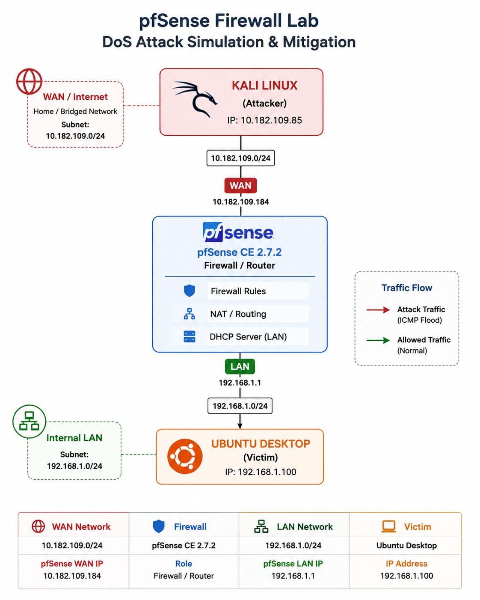
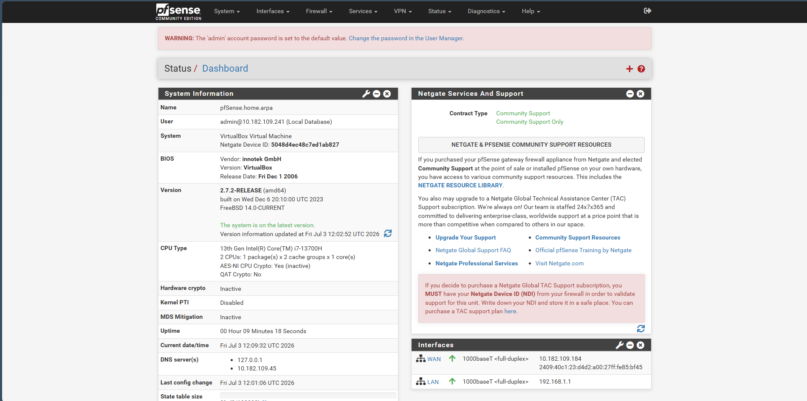
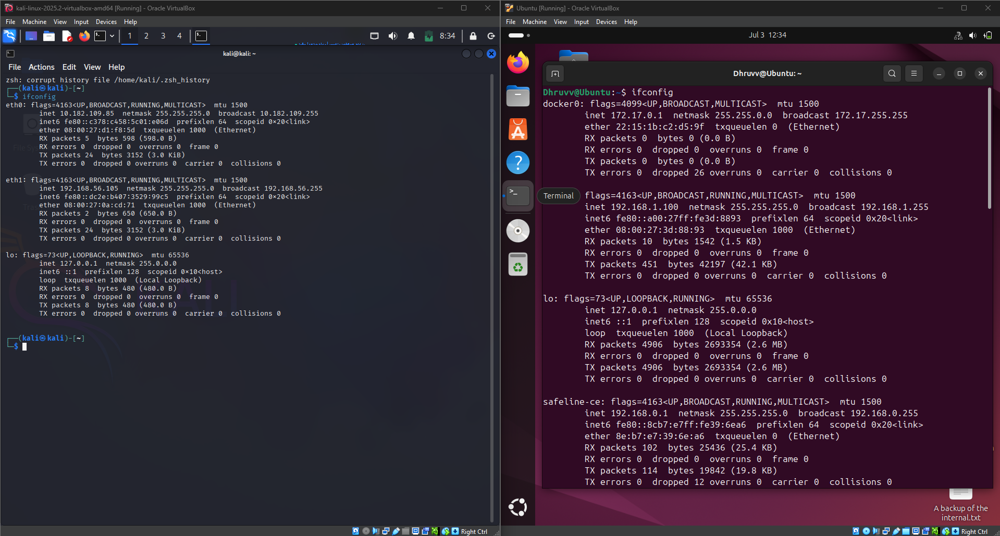
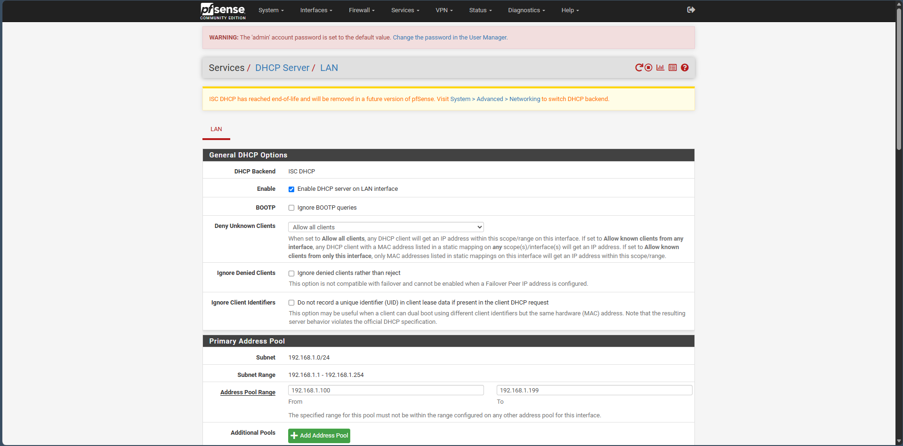
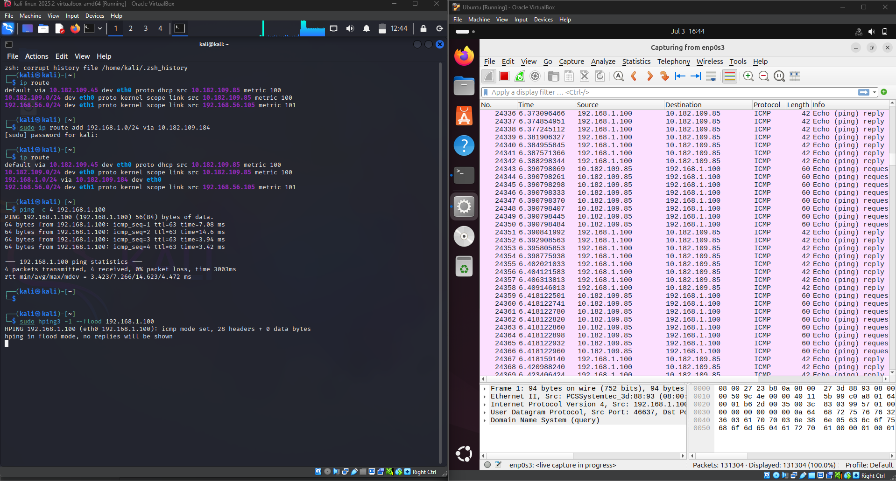
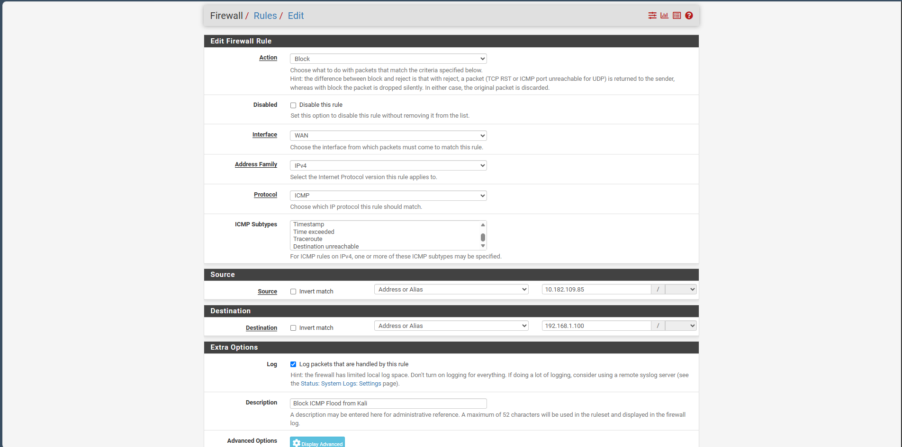
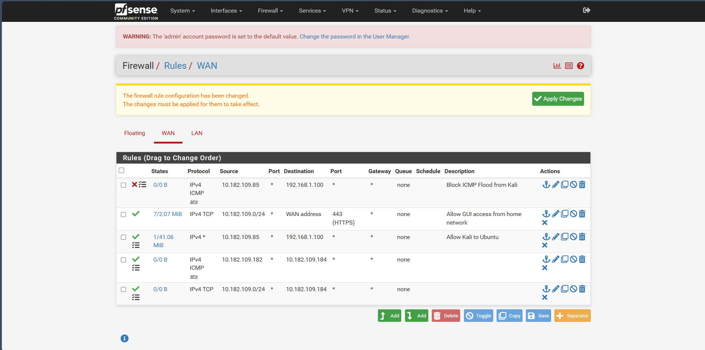
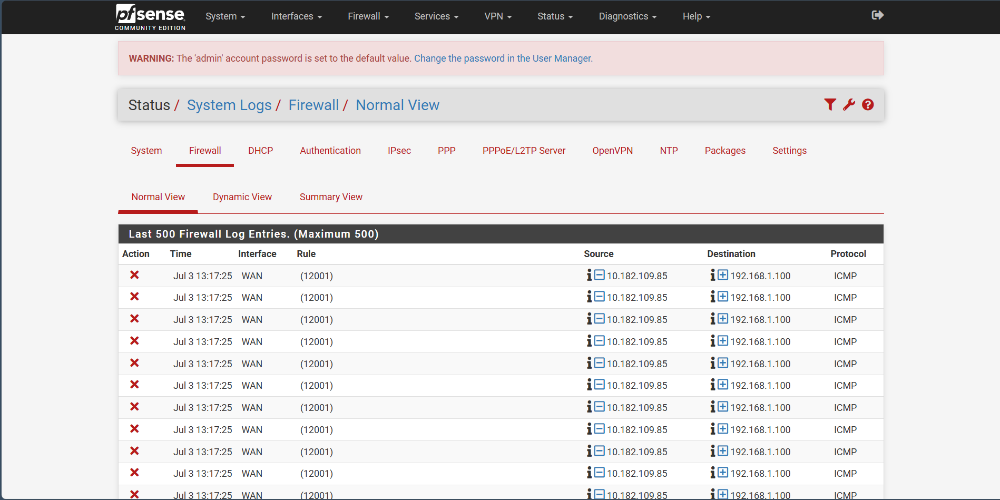
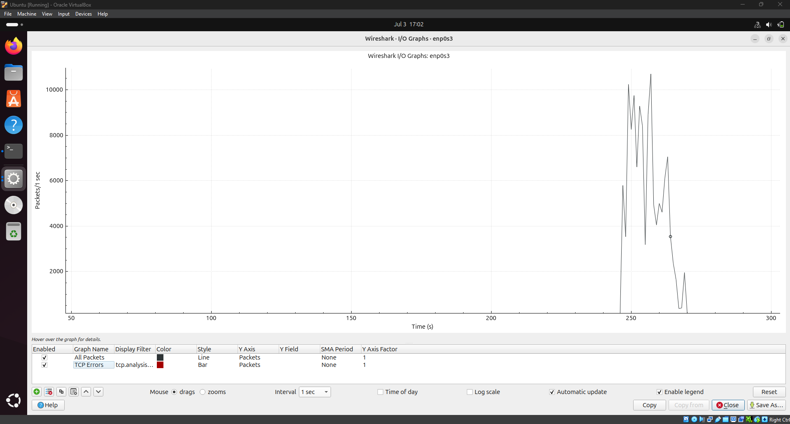

# 🛡️ pfSense Firewall Lab – DoS Attack Simulation & Mitigation

A hands-on cybersecurity home lab demonstrating **network segmentation, firewall administration, attack simulation, traffic analysis, and firewall-based mitigation** using **pfSense CE**, **Kali Linux**, **Ubuntu Desktop**, and **Wireshark**.

---

## 📌 Project Overview

This project demonstrates how a **pfSense firewall** can detect and mitigate an **ICMP Denial-of-Service (DoS) attack** within a segmented virtual network.

The lab was built entirely in **VirtualBox** using three virtual machines:

- **Kali Linux** – External attacker
- **pfSense CE 2.7.2** – Edge firewall and gateway
- **Ubuntu Desktop 22.04** – Internal victim host

The attack was generated using **hping3**, analyzed in **Wireshark**, and successfully mitigated by creating a **WAN firewall rule** on pfSense. Firewall logs and network traffic analysis were used to verify that malicious traffic was blocked successfully.

---

## 🎯 Objectives

- Build a segmented virtual network using pfSense.
- Configure WAN and LAN interfaces.
- Configure DHCP services on the LAN.
- Simulate an ICMP flood attack using hping3.
- Capture and analyze attack traffic using Wireshark.
- Configure firewall rules to block malicious traffic.
- Verify mitigation using pfSense firewall logs.
- Demonstrate fundamental Blue Team network defense concepts.

  ---

## 🛠️ Technologies Used

| Category | Technologies |
|----------|--------------|
| Firewall | pfSense CE 2.7.2 |
| Operating Systems | Kali Linux, Ubuntu Desktop 22.04 |
| Virtualization | Oracle VirtualBox |
| Network Analysis | Wireshark |
| Attack Simulation | hping3 |
| Networking | TCP/IP, ICMP, DHCP, Static Routing |
| Security | Firewall Rules, Packet Filtering, Traffic Monitoring |

---

## 💡 Skills Demonstrated

- Firewall Administration (pfSense)
- Network Segmentation
- TCP/IP Networking
- ICMP Protocol Analysis
- Packet Capture & Analysis
- Firewall Rule Management
- Network Traffic Monitoring
- DoS Attack Simulation
- Security Event Verification
- Virtual Lab Deployment
- DHCP Configuration
- Blue Team Fundamentals

---

## 🏗️ Lab Architecture

The lab consists of three virtual machines running inside Oracle VirtualBox. Kali Linux acts as an external attacker on the WAN network, pfSense functions as the edge firewall and gateway, and Ubuntu Desktop serves as the victim host on the internal LAN. The firewall controls traffic between the two network segments and mitigates malicious traffic through firewall rules.

---

## 🌐 Network Topology

<p align="center">
  
</p>

---

## 🖥️ Lab Environment

| Component | Configuration |
|-----------|---------------|
| Hypervisor | Oracle VirtualBox 7.x |
| Firewall | pfSense CE 2.7.2 |
| Attacker Machine | Kali Linux |
| Victim Machine | Ubuntu Desktop 22.04 |
| WAN Network | Bridged Adapter (Home Network) |
| LAN Network | Internal Network (192.168.1.0/24) |
| pfSense WAN IP | 10.182.109.184 |
| pfSense LAN IP | 192.168.1.1 |
| Kali Linux IP | 10.182.109.85 |
| Ubuntu Desktop IP | 192.168.1.100 |
| Attack Tool | hping3 |
| Analysis Tool | Wireshark |

---

## 🔀 Attack Flow

```text
Kali Linux
     │
     │  ICMP Flood (hping3)
     ▼
+------------------+
|     pfSense      |
| Firewall Gateway |
+------------------+
     │
     ▼
Ubuntu Desktop

↓

Wireshark captures the traffic

↓

pfSense Firewall Rule blocks the attack

↓

Firewall Logs confirm blocked packets

↓

Traffic returns to normal
```

---

## ⚙️ Project Methodology

The lab was implemented in a structured approach to simulate a real-world network security scenario, where an external attacker attempted to launch a Denial-of-Service (DoS) attack against an internal host protected by a firewall.

### Phase 1 – Virtual Lab Deployment

- Created three virtual machines using Oracle VirtualBox.
- Installed and configured:
  - pfSense CE 2.7.2
  - Kali Linux (Attacker)
  - Ubuntu Desktop 22.04 (Victim)
- Configured a bridged WAN network and an isolated internal LAN.

---

### Phase 2 – Firewall Configuration

- Assigned WAN and LAN interfaces in pfSense.
- Configured the LAN interface with IP address **192.168.1.1/24**.
- Enabled the DHCP Server on the LAN.
- Configured the DHCP address pool (**192.168.1.100 – 192.168.1.199**).
- Created a firewall rule to allow HTTPS access to the pfSense WebGUI from the WAN.
- Added a temporary firewall rule allowing communication from the Kali Linux attacker to the Ubuntu host for attack simulation.

---

### Phase 3 – Connectivity Verification

- Verified IP address assignment for all virtual machines.
- Added a static route on Kali Linux to reach the internal LAN through pfSense.
- Verified successful communication by sending ICMP Echo Requests (Ping) from Kali Linux to Ubuntu Desktop.

---

### Phase 4 – Attack Simulation

- Started packet capture on the Ubuntu Desktop using Wireshark.
- Generated an ICMP Flood attack from Kali Linux using **hping3**.
- Observed a significant increase in ICMP traffic arriving at the victim machine.
- Confirmed continuous packet transmission during the attack.

---

### Phase 5 – Detection & Analysis

- Monitored live packet captures using Wireshark.
- Verified the ICMP flood through packet analysis and traffic statistics.
- Generated a traffic graph to visualize the attack volume.

---

### Phase 6 – Firewall Mitigation

- Created a **Block Rule** on the pfSense WAN interface.
- Configured the rule to block traffic originating from the attacker's IP address.
- Enabled logging for the firewall rule.
- Positioned the Block Rule above the temporary Allow Rule to ensure correct rule processing.

---

### Phase 7 – Verification

- Confirmed that the ICMP flood traffic stopped after applying the firewall rule.
- Verified blocked packets through pfSense Firewall Logs.
- Compared network traffic before and after mitigation using the Wireshark I/O Graph.
- Validated that the firewall successfully mitigated the simulated DoS attack.

---

## 📸 Project Walkthrough

The following screenshots highlight the major stages of the project, from the initial firewall configuration to attack simulation, traffic analysis, mitigation, and verification.

---

### 1. pfSense Dashboard

The pfSense dashboard displaying the overall firewall status, active interfaces, and system information after successful configuration.

<p align="center">
  
</p>

---

### 2. Lab Network Configuration

Network configuration showing the IP addressing of the attacker (Kali Linux), pfSense firewall interfaces, and the victim (Ubuntu Desktop).

<p align="center">
  
</p>

---

### 3. DHCP Server Configuration

DHCP configuration on the LAN interface providing automatic IP address assignment to hosts within the internal network.

<p align="center">
  
</p>

---

### 4. Connectivity Verification & Traffic Capture

Connectivity verification between Kali Linux and Ubuntu Desktop while capturing ICMP traffic using Wireshark before implementing firewall mitigation.

<p align="center">
  
</p>

---

### 5. Firewall Block Rule Configuration

Creation of a firewall rule on the WAN interface to block malicious ICMP traffic generated by the attacker.

<p align="center">
  
</p>

---

### 6. Final Firewall Rules

Final pfSense firewall ruleset showing the Block Rule placed above the Allow Rule to ensure malicious traffic is filtered correctly.

<p align="center">
  
</p>

---

### 7. Firewall Logs

Firewall logs confirming that ICMP packets generated during the attack were successfully blocked by pfSense.

<p align="center">
  
</p>

---

### 8. Wireshark Traffic Graph

Traffic analysis using the Wireshark I/O Graph illustrating the spike in ICMP traffic during the attack and the reduction after firewall mitigation.

<p align="center">
  
</p>

---

---

# 📊 Results & Verification

The project successfully demonstrated the complete lifecycle of a network-based Denial-of-Service (DoS) attack and its mitigation using a pfSense firewall.

### Key Results

- Successfully deployed a segmented virtual network using Oracle VirtualBox.
- Configured pfSense as the edge firewall with separate WAN and LAN interfaces.
- Enabled DHCP services for the internal network.
- Simulated an ICMP Flood attack using **hping3** from Kali Linux.
- Captured and analyzed attack traffic using **Wireshark**.
- Implemented a WAN firewall rule to block malicious ICMP traffic.
- Verified successful mitigation through **pfSense Firewall Logs**.
- Confirmed traffic reduction using the **Wireshark I/O Graph**.

---

# 🎯 Skills Demonstrated

This project demonstrates practical experience in:

- Firewall Administration (pfSense)
- Network Segmentation
- TCP/IP Networking
- ICMP Protocol Analysis
- DHCP Configuration
- Firewall Rule Management
- Traffic Analysis
- Packet Capture
- Network Monitoring
- Security Verification
- Virtual Lab Deployment
- Blue Team Fundamentals

---

# 📚 Key Learnings

During this project, I gained practical experience in:

- Designing segmented network architectures using pfSense.
- Understanding WAN and LAN network isolation.
- Configuring firewall rules to permit and block network traffic.
- Simulating DoS attacks in a controlled lab environment.
- Using Wireshark to inspect and analyze network packets.
- Monitoring firewall logs to validate security controls.
- Understanding the importance of firewall rule order and logging.
- Applying Blue Team techniques to detect and mitigate network attacks.

---


# 📂 Repository Structure

```text
pfsense-firewall-lab/
│
├── diagrams/
│   └── network-topology.png
│
├── screenshots/
│   ├── 01-pfsense-dashboard.png
│   ├── 02-lab-network-configuration.png
│   ├── 03-dhcp-server-configuration.png
│   ├── 04-connectivity-verification.png
│   ├── 05-block-rule-configuration.png
│   ├── 06-final-firewall-rules.png
│   ├── 07-firewall-logs-blocked.png
│   └── 08-wireshark-traffic-graph.png
│
├── docs/
├── LICENSE
└── README.md
```

---

# 📖 References

- pfSense CE Documentation
- Oracle VirtualBox Documentation
- Wireshark User Guide
- Kali Linux Documentation
- Ubuntu Server Documentation
- hping3 Documentation

---

# 📝 License

This project is licensed under the **MIT License**.

---


